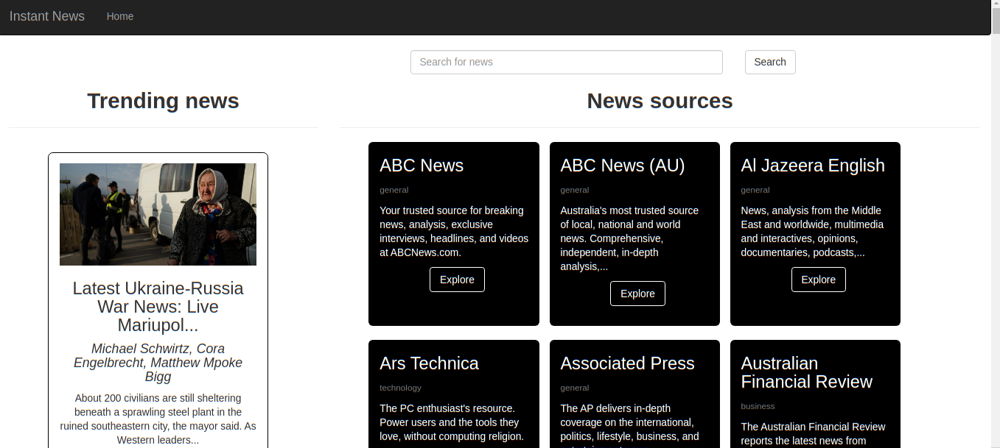

# Instant News

# Author - Victoria Makena
# Description
An application that consumes a news API to bring you the most recent news in an efficient and stylistically packaged UI.

# Live link

# Features
* A landing page with a list of some of the most popular news publishers and current trending news articles.
* A display of articles from a selected news publisher.
* A navigation bar with a link to navigate back to the landing page.

# Behaviour Driven Development
### BEHAVIOUR
The page loads up and shows various news sources and highlights of trending news articles.

### INPUT
On the landing page the user can click the explore button to view news articles from a particular source.
The user can search for news on search bar.

### OUTPUT
The articles from the selected source are displayed with a 'read more' button to read full article on the source's website.
Search results (articles) are displayed for further exploration.

# Setup Instruction
PLease ignore <> when typing commands.

* Clone this repository
* On your terminal type the command: git clone <repo link>
* The project folder is cloned to your local machine
* Activate the virtual environment using command: source news/bin/activate
* Install all requirements for the project using the command: pip install -r requirements.txt
* Activate the manage file using command: chmod a+x start.sh
* Run the project on localhost using command: ./start.sh

Alternatively you can directly visit the Instant News site using this link:

# Technologies used
Python 3.9.7
Flask 1.1.4
HTML/CSS

For more info on this check the requirements.txt file

# License
Copyright (c) 2022 MIT License. [View License Here](LICENSE)

# Contact Information
Email: makenavictoria1@gmail.com

 